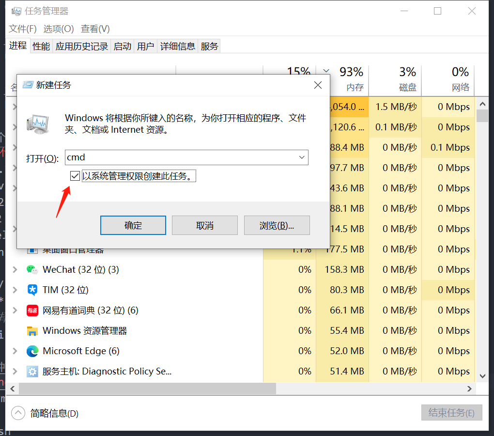

# nvm node版本管理工具
安装包 nvm-setup.exe 
## 常用命令
```  bash
# 查看本地安装的所有版本
nvm list
# 安装命令中的版本号
nvm install 14.17.0
# 使用特定版本
nvm use 14.17.0
```
如果有报错请使用管理员运行命令 
## 使用管理员运行命令
control+shift+esc 打开任务管理器,点击文件，运行新任务，输入cmd，勾选以管理员身份运行

